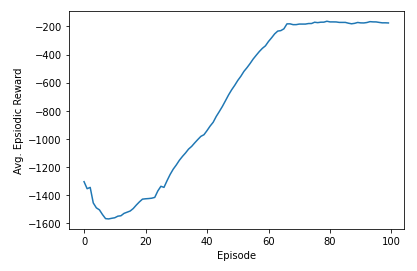

# TD3 implementation (USD,EiTI WUT)

Implementation of TD3( Twin Delayed DDPG - https://arxiv.org/abs/1802.09477v3 ) algorithm based on DDPG Keras implementation example: https://keras.io/examples/rl/ddpg_pendulum/. Implementation of model with training and evaluation is located in:

```/td3/td3.py``` python file.

## Authors
- https://github.com/Marta181
- https://github.com/jnachyla

## Results

Model was tested on Pendulum environment(https://gymnasium.farama.org/environments/classic_control/pendulum/).

Model was evaluated over 100 episodes with results: Mean Reward -156.063194 with standard deviation: 2.323086.

Episode Reward in Training TD3 on Pendulum Env.




## Instalation
### Virtual Env
To create a virtual environment, enter the following command in the terminal:
```bash
$ python3 -m venv environment_name
```
In the next step, activate the virtual environment.
On Linux, the command is:
```bash
$ source environment_name/bin/activate
```
On Windows systems:
```bash
> .\environment_name\Scripts\activate.bat
```
The name of the environment will appear in parentheses at the beginning of the line. The environment is ready.

Source: https://kamil.kwapisz.pl/srodowiska-wirtualne/#Pipenv
### Install required libraries
The required libraries and their versions are in the requirements.txt file.

After creating the virtual environment, you can install it with the command:
```bash
pip3 install -r requirements.txt
```
